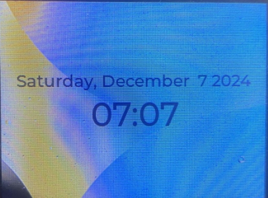
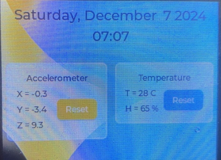
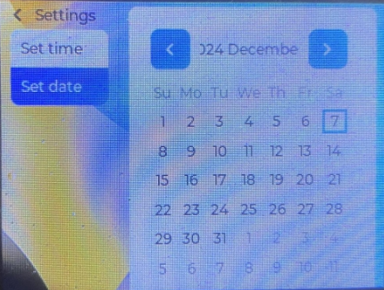

# ESP32 Clock screen and sensor view GUI
Digital Clock and Sensor View Dashboard for ESP32 with LVGL9 library.
## Features
* Digital clock & calendar.
* Dashboard for viewing DHT11 temperature sensor and MMA8451 accelerometer data.
## Setup
* Install ESP IDF, then clone this repository.
* Configure your LCD, sensor and keypad pins in sensorControlConfig.h. This project is currently running on LCD driver ili9341.
* In the GUI, press UP/DOWN to navigate between pages. Press OK on the Clock View page to open the setting. 
## Demo

